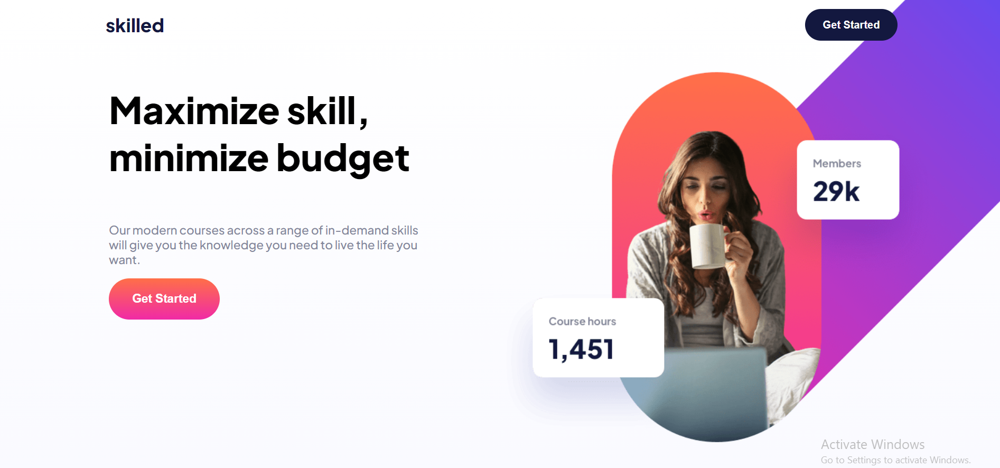

## Table of contents

- [Overview](#overview)
  - [The challenge](#the-challenge)
  - [Screenshot](#screenshot)
  - [Links](#links)
- [My process](#my-process)
  - [Built with](#built-with)
  - [What I learned](#what-i-learned)
  - [Continued development](#continued-development)
- [Author](#author)

## Overview

### The challenge

Users should be able to:

- View the optimal layout depending on their device's screen size
- See hover states for interactive elements

### Screenshot

### Links

- Solution URL: [GitHub](https://github.com/gabadadzeluca/skilled-elearning-landing-page)
- Live Site URL: [Live URL](https://gabadadzeluca.github.io/skilled-elearning-landing-page/)

## My process

### Built with

- Semantic HTML5 markup
- CSS custom properties
- Flexbox
- Mobile-first workflow

### What I learned

I learnt using more efficient HTML, using flex in css. Practised mobile first workflow. Also used position: relative; for the first time

### Continued development

I have written this code for 3 times in total, correcting and being more efficient each time. I think I could have asked for held, instead of doing something incorrectly over and over again.

## Author

- Website - [Luca Gabadadze](https://www.linkedin.com/in/luca-gabadadze-6068b324a/)

